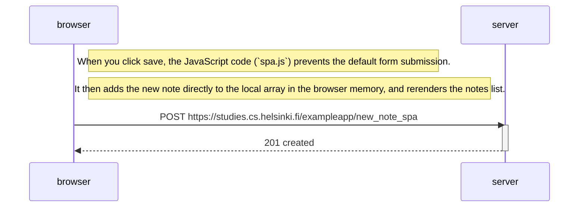

```mermaid
sequenceDiagram
    participant browser
    participant server

    Note right of browser: When you click save, the JavaScript code (`spa.js`) prevents the default form submission.
    Note right of browser:  It then adds the new note directly to the local array in the browser memory, and rerenders the notes list.

    browser->>server: POST https://studies.cs.helsinki.fi/exampleapp/new_note_spa
    activate server
    server-->>browser: 201 created
    deactivate server

```